## **Saving Babies With Machine Learning and Time Series Analysis**

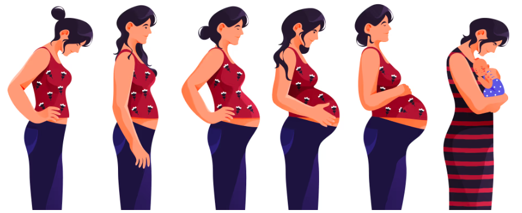

### **Overview**

This project investigates the application of machine learning and time series classification techniques for fetal movement detection using wearable sensor data. The dataset, collected by clinicians at a maternity hospital in Ireland, was recorded using the FeMo (Fetal Movement Monitoring) belt, a non-invasive wearable system equipped with piezoelectric sensors. It includes sensor signals alongside maternal button-press annotations marking perceived fetal movements. Accurate detection of fetal movements is critical for prenatal care, providing early indicators of fetal health and wellbeing. The goal of this work is to contribute towards the development of lightweight, scalable, and non-invasive prenatal monitoring systems, enabling more accessible and proactive maternal and fetal healthcare.

&nbsp;

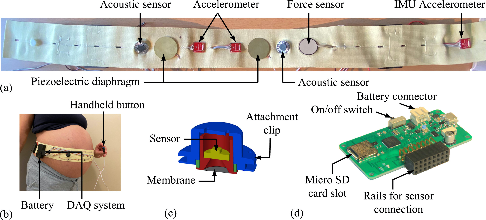

**Figure 1.** Hardware system for the wearable fetal movement monitor. (a) Sensors embedded in an elastic belt, (b) belt worn by a pregnant participant, (c) CAD design of the custom-made acoustic sensor, and (d) miniaturised (62 mm × 31 mm) DAQ system designed for the FM monitor.  

*Image adapted from Ghosh et al., 2024. [Source](https://www.sciencedirect.com/science/article/pii/S1566253523004402).*

---

### **Dataset**

The dataset was collected by clinicians at a maternity hospital in Ireland and involved 40 participants at 36 to 40 weeks of gestation. Data was recorded using the FeMo wearable monitoring system, with particular focus on belts A and C, which incorporated large piezoelectric sensors positioned at p1 and p4. For this study, only the supervised hospital sessions were used, where participants manually annotated perceived fetal movements by pressing a button. These annotations served as the ground truth for model training and evaluation.

---

### **Project Objectives**

- Explore the use of state-of-the-art time series classification techniques (Quant, Rocket, Hydra) for fetal movement detection.

- Develop an efficient, lightweight pipeline optimised for minimalistic wearable sensor data.

- Investigate the impact of different sample generation strategies and class balancing techniques on classification performance.

- Evaluate model performance using participant-independent splits to ensure generalisability.

- Assess whether accurate movement detection is achievable using piezoelectric sensor data (p1 and p4), without the need for complex sensor fusion.

- Identify challenges and opportunities for future research towards scalable, non-invasive prenatal monitoring systems.

---

### **Methodology**

**1. Data Preprocessing:**  

  - Cleaned and validated raw sensor data collected from wearable FeMo belts.  

  - Focused analysis on signals from piezoelectric sensors p1 and p4, which consistently provided the highest signal quality.  

  - Removed noisy segments such as belt adjustment periods by trimming the first and last minutes of each hospital recording session.

&nbsp;

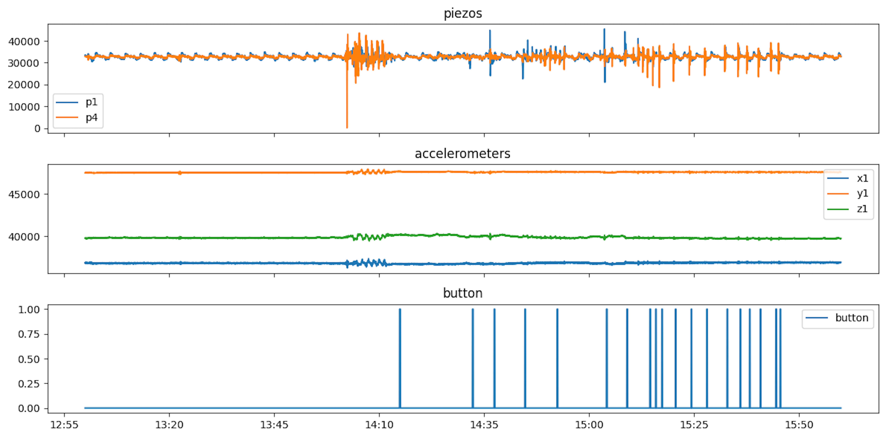

**Fig. 2.** Example of raw sensor data recorded during a 3-minute hospital session. Signals from piezoelectric sensors (p1 and p4), accelerometers, and maternal button-click annotations are shown, illustrating the complexity and variability of the recorded fetal movement data.

**2. Sample Generation:**  

  - **Strategy 1:** Generated non-overlapping 5-second windows centred around maternally annotated button-click events, targeting periods of fetal movement.
  
  &nbsp;

  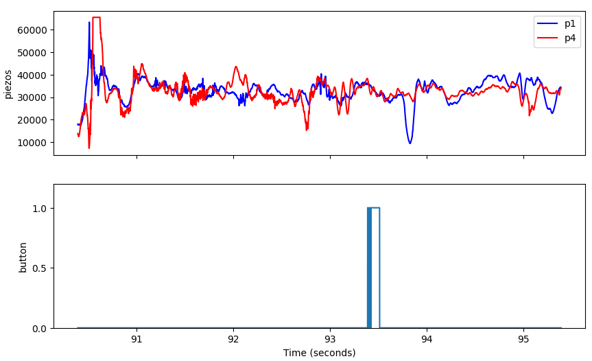

  **Fig. 3.** Example of a Strategy 1 positive sample. A 5-second window centred around a maternally-perceived fetal movement event is shown. The window includes 3 seconds before and 2 seconds after the button press, with p1 and p4 piezoelectric sensor signals displayed. The positive label captures movement-related signal changes surrounding the click event.

  - **Strategy 2:** Segmented entire sessions into non-overlapping 5-second windows, labelling windows based on the presence or absence of a button-click. 

    &nbsp;

    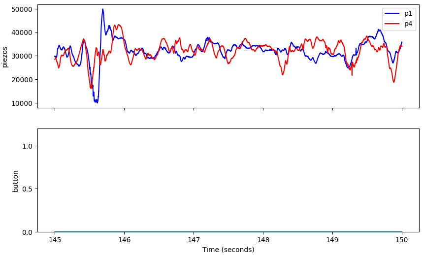

    **Fig. 4.**: Example of a Strategy 2 negative sample. The plot shows a 5-second window where no
    maternally-perceived fetal movements were reported, with signals from both p1 and p4 piezoelectric
    sensors displayed. The absence of button clicks across the window led to the negative label.

  - **Strategy 3:** Introduced overlapping positive windows around click events to augment the number of movement samples and enhance recall.

 

<!-- Row 1 -->

  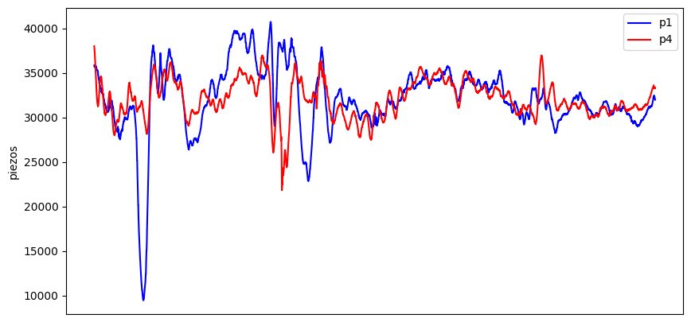
  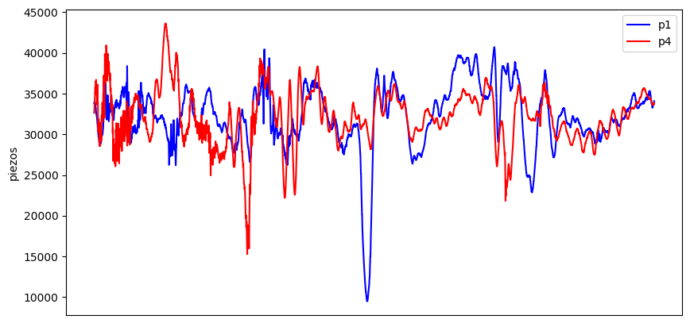
  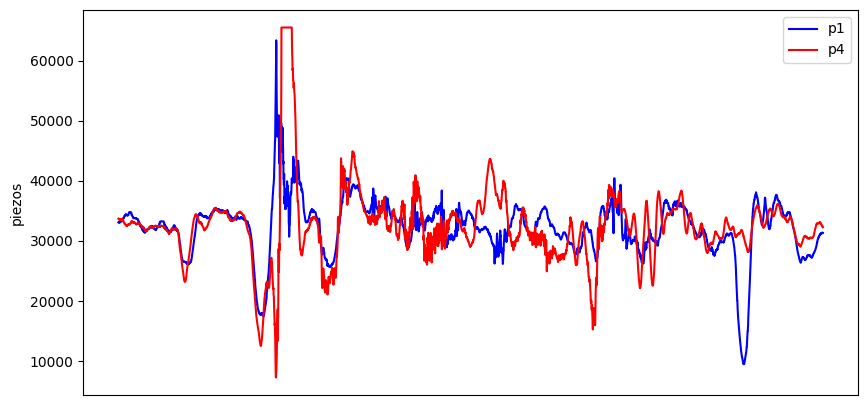

<!-- Row 2 -->

  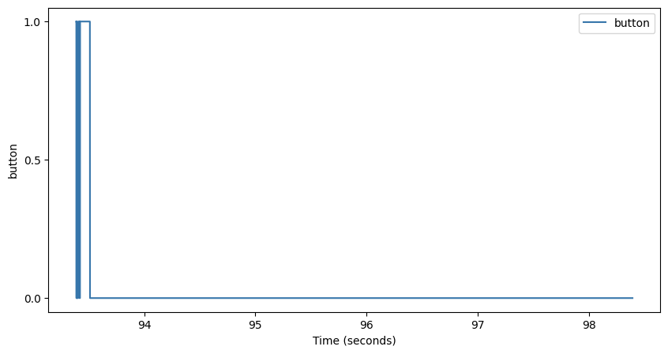
  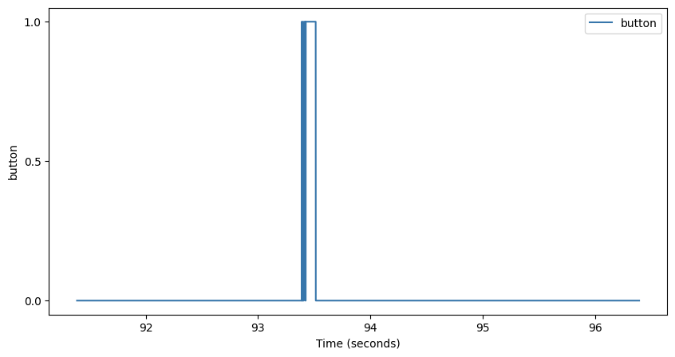
  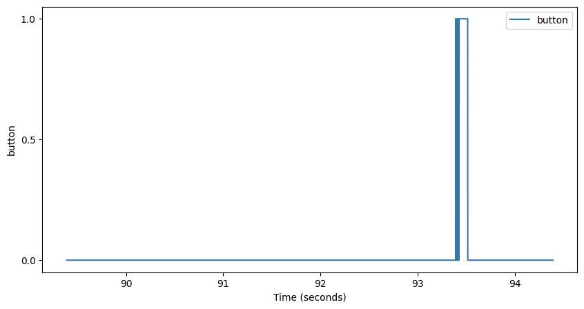

 

**Figure 4:** Illustration of Strategy 3 sampling. Multiple overlapping 5-second positive samples
were generated from a single button press event by shifting the window slightly forward and
backward. Signals from p1 and p4 are shown across different shifted windows, enhancing training
diversity while targeting the same fetal movement event.

**3. Model Training:**  

  - Initially compared state-of-the-art time series classifiers, including Quant, Rocket, and Hydra, alongside conventional machine learning models.

  - Selected a lightweight pipeline combining QUANT feature extraction, StandardScaler, and Linear Discriminant Analysis (LDA) based on superior baseline performance.  

  - Applied class balancing techniques, evaluating both 2:1 negative-to-positive and 2:1 positive-to-negative setups to address dataset imbalance.  

  - Focused subsequent experiments on refining and evaluating the QUANT + Scaling + LDA pipeline.

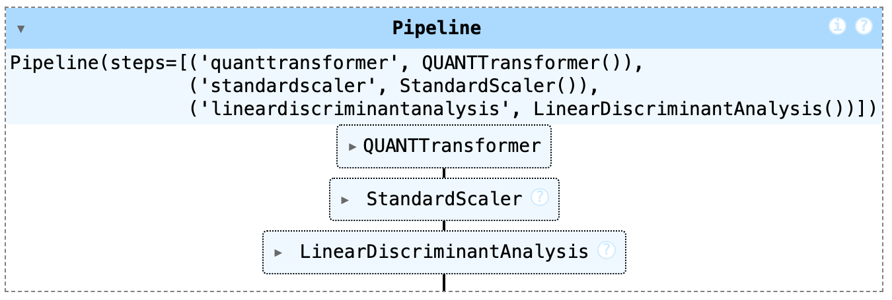  

**Figure 2.**  Final classification pipeline used in this project. The pipeline consists of a QUANTTransformer for feature extraction, followed by StandardScaler for normalisation, and LinearDiscriminantAnalysis (LDA) for classification.

**4. Evaluation** 

  - Models were evaluated using F1-Score, average accuracy, precision, and recall to account for class imbalance and clinical relevance.  

  - Strict participant-independent train-test splits were used to robustly measure model generalisation across unseen subjects.

---

### **Key Results**

- **Feasibility:**  

  Baseline fetal movement classification is achievable using a minimalistic, non-invasive sensor configuration. The results provide a strong foundation for future research in scalable prenatal monitoring. 

- **Best Pipeline Performance:**  

  - **Pipeline:** QUANT + Scaling + LDA  
  - **Data:**: Achieved using p1 sensor data with balanced training and testing sets
  - **F1-Score:** 0.52  
  - **Average Accuracy:** 0.65  

- **Sensor Findings:**  

  - Adding p4 alongside p1 did not significantly improve model generalisation.  

  - p1 alone provided more consistent and reliable performance.

- **Sampling Strategy Insights:**  

  - Targeted sampling around maternal clicks (Strategy 1) was essential for capturing relevant movement events.  

  - Rigorous class balancing greatly improved F1-score and recall.

- **Augmentation Trade-Offs:**  

  - Overlapping positive windows (Strategy 3) substantially boosted recall.  

  - However, it increased false positives, reflecting a classic sensitivity-specificity trade-off.

---

### **Project Structure**

The repository is organised as follows:

- **README.md**: Project overview, setup instructions, and key information.

- **requirements.txt**: Python package dependencies.

- **data/**: Folder for input data (not included in the public repository).

- **images/**: Images used for documentation and visualisations.

- **models/**: Saved trained models (e.g., .pkl files).

- **notebooks/**: Jupyter notebooks for data exploration, model training, and evaluation.

- **src/**: Source code modules for data preprocessing, sample generation strategies, model building, and evaluation utilities.

---

### **Future Work**

- Incorporate multimodal sensor fusion by combining piezoelectric and IMU sensor data.

- Extend validation to include unsupervised home recording sessions.

- Explore deep learning architectures such as CNNs and hybrid CNN-LSTM models.

- Integrate real-time movement detection capabilities.

- Validate findings using ultrasound-confirmed movement annotations.

---

### **Acknowledgements**

I would like to thank Assoc. Prof. Georgiana Ifrim for her exceptional supervision and guidance througohut this project. I am also grateful to Dr. Colin Boyle and Prof. Niamh Nowlan from the FeMo team for their biomedical engineering expertise. Special thanks to the mothers who participated in the FeMo study for making this research possible.

---

### **Disclaimer**

This project was conducted solely for academic research purposes.  The models and findings presented here are not intended for clinical use without further validation and regulatory approval.

